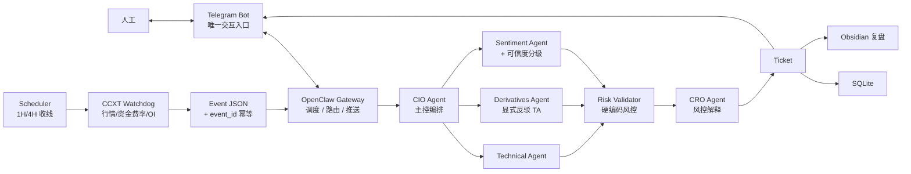

# OpenClaw Perp Analyst 合并架构 v0.1

> 合并来源：[[OpenClaw Perp Analyst 草案大纲]]（哲学与纪律层）+ [[半自动架构]]（工程与体验层）。
> 第一阶段定位：永续合约**分析与风控提案系统**，不自动下单。LLM 只产证据与解释，风控数字一律由代码计算。

---

## 0. 合并原则

**取 Doc 1 的纪律：**
- 硬编码风控（Risk Validator）。LLM 不算仓位、不算止损、不算强平价。
- 事件驱动 + `event_id` 幂等。
- Phase -1 历史回测前置，先证伪 Watchdog 阈值。
- 错误事件分类（`ANALYSIS_FAILED` / `DATA_STALE` / `HEARTBEAT_SILENT` / `DUPLICATE_EVENT_SKIPPED`）。
- 舆情可信度分级（`HIGH/MEDIUM/LOW/UNKNOWN`）与权重规则。
- 多 Agent 结构性对抗：Derivatives 显式反驳 Technical。
- Ticket / 风控记录分表存储。

**取 Doc 2 的工程：**
- 项目目录结构与 SQLite 起步。
- Telegram 单入口 + 命令集。
- 信号卡片：分批止盈、移动止损、减仓提醒、失效条件。
- 阶段时间盒（2–3 天一里程碑）。
- 模型分层：Codex / Hermes / Claude / Haiku 按成本分工。

**两份都要改：**
- `confidence` 改枚举或重命名为 `self_reported_confidence`。
- 所有持久化记录加 `prompt_version` 与 `agent_versions`。
- 命令分快速读盘（`/sol`）与完整流水线（`/solusdt`）两条路径。
- 触发阈值改成滚动百分位 / z-score，不写死绝对值。
- 第一阶段杠杆上限 ≤2x，不用 5x。
- Agent 只读冻结快照，不允许各自临时拉实时数据。
- 事件 / 阈值 / 风控 / prompt / agent 全部版本化，保证任意 Ticket 可复算。

---

## 1. 系统定位

### 1.1 当前阶段目标

- 事件驱动 + 定时收线双模触发的永续合约分析助手。
- Watchdog 监控行情异常，OpenClaw 编排多 Agent 出报告。
- 风控数字由代码模块计算，LLM 只解释。
- 输出结构化 Ticket，推送到 Telegram。
- 人工决定是否进场。

### 1.2 非目标

- 不让 LLM 自动下单。
- 不让 LLM 持有 OKX 交易权限。
- 不把 Obsidian 当实时交易数据库或风控规则源。
- 不追求高频。
- 不以单次分析作为实盘依据。

### 1.3 监控范围（首版）

- 标的：BTC-USDT-SWAP / ETH-USDT-SWAP / SOL-USDT-SWAP。
- 周期：1H / 4H 为主，15m 仅用于入场节奏辅助。
- 资金规模：纸交易阶段不限制，实盘起步 ≤200U，杠杆 ≤2x。

---

## 2. 整体架构



### 2.1 Watchdog → OpenClaw 通信协议

第一阶段：本地 CLI 调用，单进程串行队列。

```bash
/Users/lin/.local/node-v24.16.0-darwin-arm64/bin/openclaw agent \
  --agent perp_cio \
  --session-key agent:perp_cio:perp-watchdog \
  --message '<EVENT_JSON>' \
  --timeout 120 \
  --json
```

并发与排队：

- 单进程串行处理，in-flight 上限 = 1。
- 队列上限 = 5，超出按"丢弃旧的、保留新的"策略。
- 每个事件最长 120s，超时记 `ANALYSIS_FAILED` 不重试。

事件 JSON 必须字段：

- `event_id`：`hash(symbol + timeframe + trigger_type + close_ts)`，SQLite 主键唯一约束。
- `event_schema_version`：事件结构版本，例如 `event_v0.1`。
- `created_at`：事件生成时间（UTC ISO8601）。
- `symbol` / `timeframe` / `trigger_type`。
- `market_snapshot`：相对化行情摘要（z-score、百分位）。
- `snapshot_hash`：冻结快照内容 hash，防止复盘时数据漂移。
- `raw_refs`：原始数据本地路径或对象引用，用于复盘。
- `thresholds_version`：触发该事件时使用的阈值配置版本。

注意：

- `prompt_version` / `agent_versions` 不属于 Watchdog 事件本体，由 Gateway 在创建 `analysis_runs` 时注入。
- 所有 Agent 必须读取同一份冻结 `market_snapshot` 与 `raw_refs`，不能在同一轮分析中各自拉取新的实时行情。
- 如果需要补充外部信息，必须作为新字段写入同一轮 run 的输入快照，并记录来源时间戳。

---

## 3. 模块拆分

### 3.1 Watchdog

职责：

- 用 CCXT 拉 OKX 永续公开行情（只读）。
- 监控 1H / 4H K 线收线。
- 监控资金费率、OI、波动率异常。
- 生成标准事件 JSON 并触发 Gateway。

触发类型：

- `CANDLE_CLOSE_1H` / `CANDLE_CLOSE_4H`
- `FUNDING_SPIKE`
- `OI_PULSE`
- `VOLATILITY_BREAKOUT`
- `MANUAL_REVIEW`

错误事件（不产生方向性建议，只通知人工）：

- `ANALYSIS_FAILED`：Agent 超时 / 报错 / 解析失败。
- `DATA_STALE`：行情时间戳超出阈值或被限流。
- `HEARTBEAT_SILENT`：Watchdog 超过预期间隔无产出。
- `DUPLICATE_EVENT_SKIPPED`：`event_id` 命中唯一约束。

阈值原则（重要）：

- **不写死绝对值。** funding / OI / 波动率阈值都用滚动窗口的 z-score 或百分位。
- 默认窗口：funding 取自身 90 天分布，OI 24h 变化取 30 天分布，波动率取 ATR 14 周期百分位。
- 触发条件示例：`funding_zscore > 2.0` 或 `oi_24h_pct > p95`。
- 具体阈值在 Phase -1 校准后写入 `config/thresholds.yaml`，版本化。
- funding / OI 属于厚尾分布，Phase -1 必须同时比较普通 z-score、robust z-score（median/MAD）与滚动分位。
- 阈值校准必须区分趋势 / 震荡 / 高波动 regime，避免一个全局阈值误伤不同市况。

### 3.2 CIO 主控 Agent

职责：

- 接事件、判断是否进入完整分析。
- 派发 Technical / Derivatives / Sentiment。
- 汇总冲突证据，输出方向枚举：`NO_TRADE / WATCH / CONSIDER_LONG / CONSIDER_SHORT`。
- 不直接出下单指令。

输出字段：事件摘要、多头证据、空头证据、不交易理由、人工待确认问题、是否进入 CRO。

数据边界：

- CIO 负责把 Watchdog 冻结快照传给子 Agent。
- CIO 可以拒绝进入完整分析，但不能绕过 Risk Validator 直接生成可交易 Ticket。
- CIO 输出必须保留冲突证据，不允许只给单边结论。

### 3.3 Technical Agent

输入：1H/4H K 线、EMA 偏离、布林带位置、RSI、ATR、量变。
输出：趋势状态、动量、波动率、关键失效位、ATR 数值（供 Risk Validator 用）。
原则：相对指标优先；不预测远期目标价；只描述结构与失效条件。
限制：只能读取 CIO 传入的冻结快照，不直接请求交易所实时数据。

### 3.4 Derivatives Agent（结构性反方）

输入：funding、OI、主动买卖比、爆仓密度、订单簿不平衡、basis。
输出：多头/空头拥挤度、挤仓风险、假突破风险、是否与 Technical 冲突。
原则：**职责就是反驳 Technical 的过拟合**，优先识别诱多诱空和踩踏。
限制：必须说明与 Technical 的一致点和冲突点；不能只复述 Technical 结论。

### 3.5 Sentiment Agent

输入：主流新闻、链上大额异动、宏观（DXY/利率）、社交热度。
输出：情绪方向、情绪强度、突发风险、可信度等级。

可信度等级与权重规则：

- `HIGH`：可进主论据，但必须有行情或筹码数据支持。
- `MEDIUM`：仅辅助论据。
- `LOW`：默认不参与方向判断，只放风险提示。
- `UNKNOWN`：不得支持开仓，只触发人工留意。
- 任何情绪信号都不能单独把 `NO_TRADE` 改成 `CONSIDER_LONG/SHORT`。
- 所有外部信息必须带 `source`、`published_at`、`fetched_at` 与可信度等级；无法确认时间的外部消息默认 `UNKNOWN`。

### 3.6 Risk Validator（硬编码）

**所有数字必须代码计算，LLM 只能读取与解释，不能覆盖。**

计算项：

- 单笔最大可亏损金额。
- 建议仓位上限。
- 止损距离（基于 Technical 给出的 ATR）。
- 强平价安全边际。
- 日内累计亏损 / 连续亏损是否超阈。
- 同时持仓数量上限。

硬规则（首版）：

- 单笔最大亏损 ≤ 账户权益 1%。
- 第一阶段杠杆 ≤2x，趋势未确认时 ≤1x。
- 强平价距止损价必须有足够安全边际（ATR × N，N 在 thresholds.yaml）。
- 日内亏损达阈值，所有新提案降级为 `NO_TRADE`。
- 连续亏损达阈值进入冷却期。

必需输入：

- `risk_rules_version`：当前硬规则版本。
- `account_equity`：纸交易阶段来自配置，实盘辅助阶段来自只读账户 API。
- `margin_mode`：默认 `isolated`，其他模式必须显式写入。
- `contract_specs`：合约面值、最小下单单位、价格精度、数量精度。
- `maintenance_margin_tiers`：用于估算强平安全边际。
- `fee_slippage_assumption`：手续费与滑点保守假设。
- `daily_loss_state` / `consecutive_loss_state`：来自本地数据库，不由 LLM 判断。

降级链（应对 Agent 部分失败）：

- Technical 失败 → 整单 `NO_TRADE`（无 ATR 不能算止损）。
- Derivatives 失败 → 整单 `WATCH`，禁止 `CONSIDER_*`。
- Sentiment 失败 → 继续，但 confidence 降一级。

### 3.7 CRO Agent

职责：读 Risk Validator 结构化结果 + 版本化风控规则，输出状态。

输出枚举：

- `APPROVED_FOR_MANUAL_REVIEW`
- `WATCH_ONLY`
- `REJECTED_BY_RISK`
- `NEED_MORE_DATA`

注意：**风控规则存版本化 YAML，不存 Obsidian。** Obsidian 只放人类可读说明。

---

## 4. 数据存储

### 4.1 SQLite 分表

```sql
CREATE TABLE events (
    event_id TEXT PRIMARY KEY,
    event_schema_version TEXT,
    created_at INTEGER,
    symbol TEXT,
    timeframe TEXT,
    trigger_type TEXT,
    close_ts INTEGER,
    thresholds_version TEXT,
    snapshot_hash TEXT,
    market_snapshot_json TEXT,
    raw_refs_json TEXT
);

CREATE TABLE analysis_runs (
    id INTEGER PRIMARY KEY,
    event_id TEXT,
    rerun_of INTEGER,
    started_at INTEGER,
    finished_at INTEGER,
    prompt_version TEXT,
    agent_versions_json TEXT,
    thresholds_version TEXT,
    risk_rules_version TEXT,
    status TEXT,
    error_code TEXT,
    error_message TEXT,
    cost_usd REAL,
    FOREIGN KEY(event_id) REFERENCES events(event_id),
    FOREIGN KEY(rerun_of) REFERENCES analysis_runs(id)
);

CREATE TABLE risk_checks (
    id INTEGER PRIMARY KEY,
    analysis_run_id INTEGER,
    risk_rules_version TEXT,
    account_equity REAL,
    max_loss_pct REAL,
    max_loss_amount REAL,
    leverage_cap REAL,
    stop_distance REAL,
    suggested_position_size REAL,
    margin_mode TEXT,
    liq_safety_margin REAL,
    daily_loss_state TEXT,
    consecutive_loss_state TEXT,
    input_json TEXT,
    output_json TEXT,
    verdict TEXT
);

CREATE TABLE tickets (
    id INTEGER PRIMARY KEY,
    analysis_run_id INTEGER,
    ticket_id TEXT UNIQUE,
    status TEXT,
    action TEXT,
    self_reported_confidence TEXT,
    payload_json TEXT,
    created_at INTEGER
);

CREATE TABLE manual_decisions (
    id INTEGER PRIMARY KEY,
    ticket_id INTEGER,
    decision TEXT,
    note TEXT,
    decided_at INTEGER
);

CREATE TABLE trade_reviews (
    id INTEGER PRIMARY KEY,
    ticket_id INTEGER,
    entry REAL,
    exit REAL,
    pnl REAL,
    note TEXT,
    reviewed_at INTEGER
);

CREATE TABLE quick_lookups (
    id INTEGER PRIMARY KEY,
    symbol TEXT,
    requested_at INTEGER,
    prompt_version TEXT,
    model TEXT,
    response_summary TEXT,
    cost_usd REAL
);
```

`quick_lookups` 与 `tickets` 分开，防止快速读盘污染 Phase 3 统计。

版本追踪原则：

- `events` 记录触发时的客观输入：事件 schema、阈值版本、冻结快照 hash、原始数据引用。
- `analysis_runs` 记录本次分析过程：prompt、agent、阈值、风控规则、错误码、成本。
- `risk_checks` 必须保留完整输入与输出 JSON，保证风控结果可复算。
- 任何重跑都新建 `analysis_runs`，用 `rerun_of` 指向原 run，不覆盖旧结果。

### 4.2 Obsidian 用途

- 风控规则的人类可读说明（**真正的规则在 YAML 里**）。
- 每次分析报告归档。
- 人工决策记录。
- 复盘笔记。

不放：实时订单状态、高频行情、幂等锁、并发写入状态。

---

## 5. Ticket Schema

```json
{
  "ticket_id": "tkt_2026_05_28_btc_4h_001",
  "event_id": "evt_...",
  "event_schema_version": "event_v0.1",
  "snapshot_hash": "sha256_...",
  "status": "APPROVED_FOR_MANUAL_REVIEW",
  "action": "CONSIDER_LONG",
  "symbol": "BTC-USDT-SWAP",
  "timeframe": "4H",
  "self_reported_confidence": "MEDIUM",
  "prompt_version": "cio_v0.3",
  "thresholds_version": "thresholds_v0.1",
  "risk_rules_version": "risk_rules_v0.1",
  "agent_versions": {"technical": "v0.2", "derivatives": "v0.2", "sentiment": "v0.1"},
  "entry_zone": "等待回踩 EMA20 确认，不追市价",
  "invalid_condition": "4H 收盘跌回 EMA20 下方并放量",
  "risk": {
    "max_loss_pct": 1.0,
    "max_loss_amount": 2.0,
    "suggested_leverage_cap": 2,
    "stop_distance_atr": 1.5,
    "suggested_position_size": 0.0,
    "liq_safety_margin": "PASS",
    "position_size_comment": "仅供人工参考，实际下单由人工决定"
  },
  "bull_case": [],
  "bear_case": [],
  "why_not": [],
  "human_checklist": []
}
```

注意：`self_reported_confidence` 用枚举 `HIGH/MEDIUM/LOW`，不写百分比，避免被误读为统计概率。

---

## 6. Telegram 入口

### 6.1 命令分层

**快速读盘（不进 CRO、不写 tickets，只写 quick_lookups）：**

| 命令 | 含义 |
|---|---|
| `/sol` | 单 Agent 一段话快速读盘 |
| `/btc` / `/eth` | 同上 |
| `/news BTC` | Hermes 拉外部信息摘要 |

**完整流水线（进 CRO、写 tickets）：**

| 命令 | 含义 |
|---|---|
| `/solusdt` | CIO → 三 Agent → Risk Validator → CRO → Ticket |
| `/btcusdt` / `/ethusdt` | 同上 |
| `/signal` | 列最近 N 个 Ticket |
| `/risk BTC` | 复读最近一次 BTC 的 Risk Validator 结果 |
| `/journal` | 触发 Obsidian 当日复盘写入 |

### 6.2 主动推送

- 完整流水线 Ticket 自动发送。
- 错误事件发送（标记"信号不可用"）。
- 重大舆情事件（`HIGH` 可信度）单独推送。
- 不主动发快速读盘结果。

### 6.3 信号卡片

```text
BTC/USDT 永续合约 Ticket
━━━━━━━━━━━━━━━━━━━━━━
方向：CONSIDER_LONG
置信度：MEDIUM（self-reported）
周期：4H 主，1H 辅

入场区：等待回踩 107,200 - 107,800
止损：105,500（ATR×1.5 + 结构位，代码计算）
止盈1：110,000（减仓 30%）
止盈2：113,000（减仓 40%）
止盈3：116,000（趋势延伸，移动止损）

失效：4H 收盘跌回 EMA20 下方并放量

技术面（TA）：
- 1H EMA 多头排列
- 15m 放量突破前高

筹码反方（DA）：
- funding z-score = +1.6（偏拥挤但未极端）
- OI 24h +18%（p90），假突破风险中等

舆情（SA, MEDIUM）：
- 无 HIGH 级别突发事件

CRO 风控：
- max_loss = 1%, leverage_cap = 2x
- 强平价安全边际充足
- 日内累计亏损未触发熔断

人工检查清单：
- [ ] 不是情绪化追单
- [ ] 止损位已明确
- [ ] 最大亏损可接受
- [ ] 未违反今日交易限制
```

---

## 7. 阶段路线

### Phase -1：历史回测与阈值校准（1–2 周）

- 拉 6–12 个月 1H/4H 数据 + funding/OI 历史。
- 不接 LLM，只跑 Watchdog 规则层。
- 校准滚动百分位 / z-score / robust z-score 阈值。
- 输出每个 trigger 后续 1/4/12 根 K 线的方向与波动统计。
- 产出：`config/thresholds.yaml` 初版。

Phase -1 细分：

1. 数据采集：拉 BTC/ETH/SOL 的 K 线、funding、OI、标记价格，记录数据源时间戳与缺口。
2. 特征计算：生成 ATR、EMA 偏离、布林带位置、funding z-score、OI 变化分位、波动率分位。
3. Regime 标注：至少区分趋势、震荡、高波动三类市况。
4. 触发回放：只回放 Watchdog 规则，不调用任何 LLM。
5. 样本切分：按时间切 train/test，避免用未来行情校准过去阈值。
6. 阈值报告：统计触发频率、后续 1/4/12 根 K 的最大有利/不利波动、假信号比例。
7. 冻结配置：输出 `thresholds_v0.1`，写入 `config/thresholds.yaml`。

Phase -1 通过条件：

- 每类 trigger 都能解释触发原因与历史分布位置。
- 每个标的每天平均触发量可控，不因噪声高频唤醒 LLM。
- test 区间表现没有明显劣化。
- 数据缺口、异常值处理规则已写入报告。

### Phase 0：只读分析原型（2 天）

- Watchdog 读公开行情。
- 手动 CLI 触发 OpenClaw。
- 生成 Markdown 报告。
- 不发 TG、不连私有 API。
- 可以写 SQLite dev 库验证 schema，但不得作为正式统计样本。

### Phase 1：事件驱动 + Ticket（3–4 天）

- Watchdog 自动触发。
- 三 Agent 链路打通。
- Risk Validator 与 CRO 接入。
- 写 SQLite + Obsidian。

### Phase 2a：Telegram 单向推送（2 天）

- TG Bot 接入。
- Ticket 自动发送。
- 错误事件通知。

### Phase 2b：Telegram 双向（2–3 天）

- 命令集（`/sol` 快速 vs `/solusdt` 完整）。
- 人工回复采纳/拒绝/观察，写回 `manual_decisions`。

### Phase 3：纸交易统计（≥3 个月）

验收指标：

- 样本量 ≥100 个有效 Ticket，覆盖不同市况。
- 胜率 <45% 必须复盘策略逻辑。
- 平均盈亏比 >1.3。
- 纸交易权益曲线回撤 >10% 暂停扩展。
- CRO 拒绝率：长期 >80% 触发器太宽，<15% 风控太松。
- `ANALYSIS_FAILED` >5% 先修稳定性。
- `DATA_STALE` >3% 先修数据源。
- 单 Ticket LLM 平均成本可接受。

通过条件：正期望非靠极端盈利、拒绝率/失败率/成本稳定、`why_not` 在复盘中有实际帮助、不同 trigger 能看出清晰归因。

### Phase 4：极小权限实盘辅助

- 仍不自动下单。
- 只读账户权益、持仓、保证金。
- 用真实账户状态增强风控提示。

### Phase 5：是否半自动执行

前置：纸交易稳定、风控拒绝率合理、所有事件可追溯、API Key 权限隔离 + IP 白名单、熔断与防重复下单。

---

## 8. 模型分层与成本

| 角色 | 模型建议 | 理由 |
|---|---|---|
| CIO 编排 | Opus 4.7 | 跨 Agent 推理、冲突仲裁 |
| Technical | Sonnet 4.6 | 结构化指标读图 |
| Derivatives | Sonnet 4.6 | 反方推理需要稳定指令遵循 |
| Sentiment | Haiku 4.5 | 摘要 + 可信度判断够用 |
| CRO | Sonnet 4.6 | 读结构化结果做解释 |
| 快速读盘 `/sol` | Haiku 4.5 | 一次调用，控成本 |

Phase -1 必须带成本估算，单 Ticket 成本超过预算就减少 Agent 轮次。

---

## 9. 项目目录

```text
~/Documents/trading/perp_analyst/
├── config/
│   ├── thresholds.yaml          # 触发阈值（版本化）
│   ├── risk_rules.yaml          # 风控硬规则（版本化）
│   ├── contract_specs.yaml       # 合约规格、精度、面值、保证金档位快照
│   └── prompts/                 # 各 Agent prompt，按版本归档
├── data/
│   └── trading.db               # SQLite
├── migrations/
│   └── 001_init.sql
├── collectors/
│   ├── okx.py
│   └── coingecko.py             # 仅 Phase 3+ 需要时启用
├── watchdog/
│   ├── candles.py
│   ├── funding.py
│   ├── oi.py
│   └── event_builder.py
├── analysis/
│   ├── indicators.py
│   ├── risk_validator.py        # 硬编码风控
│   └── factors.py               # z-score / 百分位标准化
├── schemas/
│   ├── event.schema.json
│   └── ticket.schema.json
├── agents/
│   ├── cio.py
│   ├── technical.py
│   ├── derivatives.py
│   ├── sentiment.py
│   └── cro.py
├── gateway/
│   └── openclaw_bridge.py
├── notify/
│   └── telegram.py
├── obsidian/
│   └── daily_log.py
├── scheduler/
│   └── jobs.py
└── main.py
```

---

## 10. 安全边界

- OKX 交易 API Key 不进 Obsidian / 聊天 / Git / LLM prompt。
- 第一版只读权限。
- 下单动作由人工在交易所或独立工具完成。
- 所有 LLM 输出仅作分析，不作指令。
- 风控数字可复算（代码 + 版本化 YAML）。
- TG 消息不展示任何密钥/账户敏感信息。

---

## 11. v0.2 优先落地顺序

先不要写完整 Agent。v0.2 只做地基：

1. 冻结 `event.schema.json` 与 `ticket.schema.json`。
2. 写 `migrations/001_init.sql`，落地本文 SQLite 分表。
3. 写 `config/risk_rules.yaml` 与 `config/contract_specs.yaml` 初版。
4. 写 `analysis/factors.py`：普通 z-score、robust z-score、滚动分位。
5. 写 Phase -1 回放脚本，产出 `thresholds_v0.1`。
6. 再接 OpenClaw CLI，先跑单事件 Markdown 报告。

验收标准：

- 任意一个历史事件都能从 DB 找回原始输入、阈值版本、风控版本、prompt 版本与输出 Ticket。
- Risk Validator 在无 LLM 的情况下可以独立运行并给出 `REJECTED_BY_RISK / WATCH_ONLY / APPROVED_FOR_MANUAL_REVIEW`。
- Agent prompt 中明确写入“只读冻结快照，不自行拉实时数据”。

---

## 12. 待补清单

### Phase -1 必须完成

- [ ] 拉 BTC/ETH/SOL 6–12 个月历史数据（K 线 + funding + OI）。
- [ ] 实现 z-score / 百分位计算模块。
- [ ] 实现 robust z-score（median/MAD）与 regime 标注。
- [ ] 写历史回测脚本，统计每类 trigger 的后续波动。
- [ ] 输出 train/test 阈值校准报告。
- [ ] 产出 `config/thresholds.yaml` 初版。
- [ ] 产出 `config/contract_specs.yaml` 初版。
- [ ] 估算单 Ticket LLM 成本。

### Phase 0–1 必须完成

- [ ] 定义并冻结事件 JSON schema。
- [ ] 实现 SQLite schema 与迁移脚本。
- [ ] 实现 Risk Validator（含降级链）。
- [ ] 定义 `risk_rules.yaml` 字段：账户权益、单笔亏损、杠杆、保证金模式、冷却期、手续费滑点假设。
- [ ] 固化 Agent 输入边界：全部读取冻结快照，禁止各自拉实时行情。
- [ ] 写 CIO / Technical / Derivatives / Sentiment / CRO prompt v0.1。
- [ ] Ticket schema 校验器。
- [ ] `risk_rules.yaml` 与 Obsidian 说明分离。

### 之后再办

- [ ] CoinGecko 截面扫描（标的扩展时再启用）。
- [ ] X/Twitter 数据源选型（确定走 xurl / xitter / opencli 哪条）。
- [ ] Telegram 双向回写。
- [ ] 实盘账户状态接入。

---

## 13. 与原始两份文档的主要差异记录

| 决策 | Doc 1 | Doc 2 | 本合并稿 |
|---|---|---|---|
| 风控位置 | 代码层 | LLM 层 | **代码层** |
| 触发模式 | 事件驱动 | 定时 + 命令 | **事件驱动 + 命令双入口** |
| 阈值定义 | TBD | 绝对值 | **滚动百分位 / z-score** |
| confidence | 0.62 浮点 | 72% | **HIGH/MEDIUM/LOW 枚举** |
| 杠杆上限 | 隐含保守 | 5x | **≤2x（趋势未确认 ≤1x）** |
| 风控规则存放 | Obsidian | 未定 | **版本化 YAML（Obsidian 只放说明）** |
| Phase -1 回测 | 有 | 无 | **保留并前置为强制** |
| 快速 vs 完整 | 无 | 单一链路 | **`/sol` vs `/solusdt` 分层** |
| 错误事件分类 | 有 | 无 | **保留** |
| prompt 版本字段 | 无 | 无 | **加入 analysis_runs 与 ticket** |
| 数据库分表 | 多表 | 单 signals 表 | **采用 Doc 1 多表设计** |
| Agent 数据来源 | 未完全冻结 | 多服务实时读 | **同一 run 只读冻结快照** |
| 复盘可复算性 | 部分可追溯 | 偏日志化 | **schema / thresholds / rules / prompt / agent 全版本化** |
