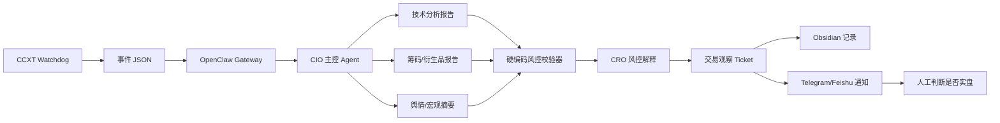

# OpenClaw Perp Analyst 草案大纲

> 定位：先做“永续合约分析与风控提案系统”，不做自动交易执行。OpenClaw 负责 Agent 分析、证据整理、风控说明和手机通知；最终是否进入实盘由人手动判断。

关联原始说明：[[未命名]]

---

## 1. 系统定位

### 1.1 当前阶段目标

- 构建一个事件驱动的永续合约分析助手。
- 由 Python Watchdog 监控行情异常与固定周期收线。
- 触发 OpenClaw Agent 生成结构化交易观察报告。
- 风控规则由硬编码模块计算，不让 LLM 直接计算仓位和强平价。
- 输出人工可读、可审计、可复盘的交易提案。
- 人工决定是否进场，第一阶段不接自动单。

### 1.2 非目标

- 不让 LLM 自动下单。
- 不让 LLM 持有 OKX 交易权限。
- 不把 Obsidian 当实时交易数据库。
- 不以单次分析结果作为实盘依据。
- 不追求高频交易或秒级抢单。

---

## 2. 总体架构



## 2.1 Watchdog 到 OpenClaw 的通信协议

第一阶段优先使用本地 CLI 调用，降低实现复杂度：

```bash
/Users/lin/.local/node-v24.16.0-darwin-arm64/bin/openclaw agent \
  --agent perp_cio \
  --session-key agent:perp_cio:perp-watchdog \
  --message '<EVENT_JSON>' \
  --timeout 120 \
  --json
```

原因：

- 不需要额外暴露 HTTP 服务。
- 适合本机 Watchdog 唤醒本机 OpenClaw Gateway。
- 可直接获得 JSON 返回，方便 Watchdog 记录成功或失败。
- Phase 0 / Phase 1 足够用。

后续可选升级：

- 本地 HTTP bridge：由 Watchdog POST 到本地服务，再由服务调用 OpenClaw。
- OpenClaw plugin：把交易事件接入做成正式工具/插件。
- Webhook/channel：当需要远程触发或跨设备触发时再引入。

通信事件必须包含：

- `event_id`：幂等 ID，防重复分析。
- `created_at`：事件生成时间。
- `symbol`：交易对。
- `timeframe`：周期。
- `trigger_type`：触发类型。
- `market_snapshot`：相对化行情摘要。
- `raw_refs`：原始数据引用或本地日志路径。

---

## 3. 模块拆分

## 3.1 Watchdog 行情看门狗

职责：

- 使用 CCXT 读取 OKX 永续合约公开行情。
- 监控 1H / 4H K 线收线。
- 监控资金费率异常。
- 监控 OI 异常变化。
- 监控价格突破布林带。
- 生成标准事件 JSON。
- 调用 OpenClaw Gateway 或 CLI 唤醒 CIO Agent。

第一版只使用只读 API 或公开接口。

触发类型：

- `CANDLE_CLOSE_1H`
- `CANDLE_CLOSE_4H`
- `FUNDING_SPIKE`
- `OI_PULSE`
- `VOLATILITY_BREAKOUT`
- `MANUAL_REVIEW`

系统错误事件：

- `ANALYSIS_FAILED`：OpenClaw Agent 超时、报错或返回无法解析。
- `DATA_STALE`：CCXT 数据滞后、交易所限流、行情时间戳过旧。
- `HEARTBEAT_SILENT`：Watchdog 超过预期间隔没有产出心跳或事件。
- `DUPLICATE_EVENT_SKIPPED`：同一 `event_id` 已处理，跳过重复触发。

错误事件处理原则：

- 不补做交易判断。
- 不生成方向性建议。
- 只通知人工“本次信号不可用/已跳过”。
- 写入本地日志，便于排查稳定性。

---

## 3.2 OpenClaw CIO 主控 Agent

职责：

- 接收 Watchdog 事件。
- 判断是否需要进入完整分析流程。
- 分派技术面、筹码面、舆情面分析任务。
- 汇总冲突证据。
- 输出初步方向：观察、偏多、偏空、跳过。
- 不直接给下单指令。

建议输出：

- 当前事件摘要。
- 多头证据。
- 空头证据。
- 不交易理由。
- 需要人工确认的问题。
- 是否进入 CRO 风控审查。

---

## 3.3 Technical Agent 技术分析

输入：

- 1H / 4H K 线。
- EMA 偏离。
- Bollinger Band 位置。
- RSI 区间。
- ATR。
- 成交量变化。

输出：

- 趋势状态。
- 动量状态。
- 波动率状态。
- 关键失效位置。
- ATR 供风控模块使用。

原则：

- 尽量使用相对指标，不直接喂长周期绝对价格。
- 不预测远期目标价。
- 只说明技术结构和失效条件。

---

## 3.4 Derivatives Agent 筹码/衍生品分析

输入：

- 资金费率。
- OI 变化。
- 主动买卖比。
- 爆仓数据。
- 订单簿不平衡。

输出：

- 多头拥挤程度。
- 空头拥挤程度。
- 挤仓风险。
- 假突破风险。
- 与技术面是否冲突。

原则：

- 专门反驳技术面过拟合。
- 优先识别诱多、诱空、踩踏和拥挤交易。

---

## 3.5 Sentiment Agent 舆情/宏观摘要

输入：

- 主要市场新闻。
- 大额链上异动。
- 美股指数状态。
- 美元指数、利率、宏观风险事件。
- 社交平台高热度叙事。

输出：

- 情绪方向。
- 情绪强度。
- 是否存在突发新闻风险。
- 是否需要降低分析置信度。
- 可信度等级：`HIGH` / `MEDIUM` / `LOW` / `UNKNOWN`。

原则：

- 舆情只作为辅助，不作为独立开仓理由。
- 来源不确定时必须标记低可信。

CIO 汇总权重规则：

- `HIGH`：可进入主论据，但必须有行情或筹码数据支持。
- `MEDIUM`：只能作为辅助论据。
- `LOW`：默认不参与方向判断，只放入风险提示。
- `UNKNOWN`：不得支持开仓，只能触发人工留意。
- 任何舆情信号都不能单独把 `NO_TRADE` 改成 `CONSIDER_LONG` 或 `CONSIDER_SHORT`。

---

## 3.6 Risk Validator 硬编码风控模块

职责：

- 计算最大可亏损金额。
- 计算建议仓位上限。
- 计算止损距离。
- 估算强平价安全边际。
- 检查单笔风险是否超限。
- 检查日内亏损和连续亏损限制。
- 检查最大同时持仓数量。

硬规则示例：

- 单笔最大亏损不超过账户权益 1% - 2%。
- 未确认趋势不得使用高杠杆。
- 强平价距离止损价必须有足够安全边际。
- 当日亏损超过阈值，所有新交易提案自动降级为 `NO_TRADE`。
- 连续亏损达到阈值，进入冷却期。

注意：

- 这里必须是代码计算，不由 LLM 心算。
- LLM 只能解释风控结果，不能覆盖风控结果。

---

## 3.7 CRO 风控解释 Agent

职责：

- 读取 Risk Validator 的结构化结果。
- 读取 Obsidian 风控规则。
- 判断提案是否违反人工规则。
- 输出批准、降级、拒绝或仅观察。

输出状态：

- `APPROVED_FOR_MANUAL_REVIEW`
- `WATCH_ONLY`
- `REJECTED_BY_RISK`
- `NEED_MORE_DATA`

说明：

- 这里的批准只代表“可给人看”，不代表系统自动下单。

---

## 4. 数据存储设计

## 4.1 Obsidian 用途

适合存：

- 风控规则。
- 策略偏好。
- 每次分析报告。
- 每次人工决策。
- 复盘笔记。

不适合存：

- 实时订单状态。
- 高频行情数据。
- 幂等事件锁。
- 多进程并发写入状态。

---

## 4.2 SQLite / JSONL 用途

建议存：

- Watchdog 事件。
- Agent 分析结果。
- 风控计算结果。
- Ticket 状态。
- 人工确认结果。
- 后续手动实盘 PnL。

最小表设计：

- `events`
- `analysis_runs`
- `risk_checks`
- `tickets`
- `manual_decisions`
- `trade_reviews`

---

## 5. Ticket 输出草案

```json
{
  "status": "APPROVED_FOR_MANUAL_REVIEW",
  "action": "CONSIDER_LONG",
  "symbol": "BTC-USDT-SWAP",
  "timeframe": "4H",
  "confidence": 0.62,
  "entry_zone": "等待回踩确认，不追市价",
  "invalid_condition": "跌回 4H EMA20 下方并放量",
  "risk": {
    "max_loss_pct": 1.0,
    "suggested_leverage_cap": 2,
    "position_size_comment": "仅供人工参考，实际下单由人工决定"
  },
  "bull_case": [],
  "bear_case": [],
  "why_not": [],
  "human_checklist": []
}
```

---

## 6. 手机通知模板

```markdown
## 永续合约观察 Ticket

标的：{{symbol}}
周期：{{timeframe}}
动作：{{action}}
置信度：{{confidence}}

### 触发原因
{{trigger_summary}}

### 多头证据
{{bull_case}}

### 空头证据
{{bear_case}}

### 为什么不该做
{{why_not}}

### 风控结论
{{risk_summary}}

### 人工检查清单
- [ ] 我确认当前不是情绪化追单
- [ ] 我确认止损位置已明确
- [ ] 我确认最大亏损可接受
- [ ] 我确认没有违反今日交易限制
```

---

## 7. 阶段路线

## Phase -1：历史回测与阈值校准

- 拉取过去 6 - 12 个月 1H / 4H 数据。
- 不接 LLM，只测试 Watchdog 规则层。
- 统计触发频率、假信号密度、信号后 N 根 K 线波动。
- 校准资金费率阈值、OI 脉冲阈值、布林带突破条件。
- 目标是先确认“什么事件值得叫醒 OpenClaw”。

初版回测指标：

- 每个 symbol 每天平均触发次数。
- 每类 trigger 的后续最大有利波动。
- 每类 trigger 的后续最大不利波动。
- 触发后 1 / 4 / 12 根 K 线的方向统计。
- 触发频率是否过高导致成本不可控。

## Phase 0：只读分析原型

- Watchdog 读取公开行情。
- 手动触发 OpenClaw 分析。
- 生成 Markdown 报告。
- 不写数据库。
- 不发手机通知。
- 不连接 OKX 私有 API。

## Phase 1：事件驱动分析

- Watchdog 自动触发 OpenClaw。
- 生成结构化 Ticket。
- 写入 Obsidian。
- 写入 JSONL 或 SQLite。
- 人工在 Obsidian 记录是否采纳。

## Phase 2：手机通知

- 接 Telegram 或 Feishu。
- Ticket 自动发送到手机。
- 人工回复采纳/拒绝/观察。
- 回复结果写回本地日志。

## Phase 3：纸交易统计

- 连续运行至少 3 个月。
- 统计胜率、盈亏比、最大回撤、拒绝率。
- 按触发类型归因。
- 按 Agent 意见冲突归因。

纸交易验收标准初版：

- 样本量：至少 100 个有效 Ticket，且覆盖不同市场环境。
- 胜率：不单独作为通过标准，但低于 45% 必须复盘策略逻辑。
- 盈亏比：平均盈利 / 平均亏损应大于 1.3。
- 最大回撤：纸交易权益曲线回撤超过 10% 时暂停扩展。
- 单笔亏损：任何单笔模拟亏损超过预设风险上限，视为风控失败。
- CRO 拒绝率：长期高于 80% 说明触发器太宽或风控太紧；低于 15% 说明风控可能太松。
- 分析失败率：`ANALYSIS_FAILED` 超过 5% 必须先修稳定性。
- 数据异常率：`DATA_STALE` 超过 3% 必须优先处理数据源可靠性。
- 成本：单个有效 Ticket 平均 LLM 成本必须可接受，否则减少 Agent 轮次。

通过条件：

- 正期望不是靠一两笔极端盈利撑起来。
- 拒绝率、失败率、成本都稳定。
- 人工复盘认为 Ticket 的 `why_not` 有实际帮助。
- 不同触发类型能看出清晰归因，而不是混成一团。

## Phase 4：极小权限实盘辅助

- 仍不自动下单。
- 只读取账户权益、持仓和保证金。
- 用真实账户状态增强风控提示。

## Phase 5：是否考虑半自动执行

前置条件：

- 纸交易表现稳定。
- 风控拒绝率合理。
- 所有事件可追溯。
- API Key 已做权限隔离和 IP 白名单。
- 有熔断、幂等、防重复下单机制。

---

## 8. 安全边界

- OKX 交易 API Key 不进入 Obsidian。
- API Key 不进入聊天记录。
- API Key 不进入 Git。
- 第一版只使用只读权限。
- 下单动作由人工在交易所或独立工具完成。
- 所有 LLM 输出只作为分析，不作为指令。
- 所有风控数字必须可复算。

---

## 9. 待补清单

- [ ] 确认监控标的列表。
- [ ] 确认周期：1H / 4H / Daily。
- [ ] 确认资金费率阈值。
- [ ] 确认 OI 异常阈值。
- [ ] 确认单笔最大亏损比例。
- [ ] 确认日内最大亏损比例。
- [ ] 确认 Obsidian 规则文件路径。
- [ ] 确认手机通知渠道。
- [ ] 确认 Watchdog 到 OpenClaw 的通信方式。
- [ ] 定义事件 JSON schema。
- [ ] 定义错误事件处理策略。
- [ ] 定义纸交易验收标准。
- [ ] 定义舆情可信度权重规则。
- [ ] 编写历史回测脚本。
- [ ] 设计 SQLite schema。
- [ ] 编写 Watchdog 只读原型。
- [ ] 编写 OpenClaw CIO prompt。
- [ ] 编写 CRO 风控 prompt。
- [ ] 编写 Ticket schema 校验器。

---

## 10. 当前判断

这套系统第一阶段应该叫 **OpenClaw Perp Analyst**，不是自动交易机器人。

它的价值不是替人下单，而是把分散的行情、筹码、舆情、风控规则压缩成一张清楚的交易观察卡片，让人工决策更冷静、更可复盘。
